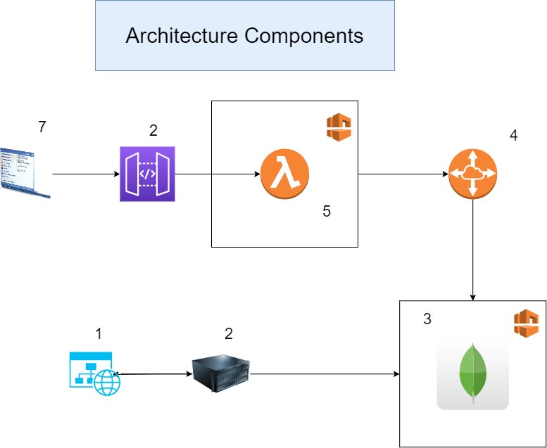
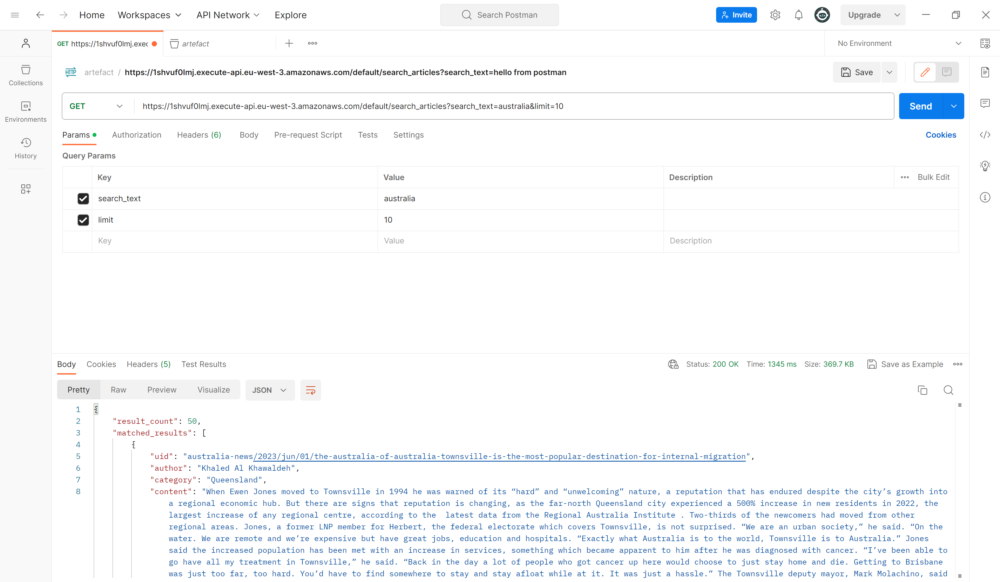

```diff
- MongoDB Cluster is currently paused, so no reads or writes are working on the cluster.
- Kindly, contact omarhosnyyy95@gmail.com to resume the cluster before using the API 
```
# Project Description
The goal of this project is to:
- Develop a web scraping application that scrapes Australia news articles from theguardian website (https://www.theguardian.com/australia-news/all) and store the result in a MongoDB collection hosted in Atlas.
- Develop a Public API that searches for keyword in articles stored in MongoDB.

# Repository content
- theguardian
    - Folder containing the scrapy project code
- lambda_function.py
    - Source code of the lambda function running on AWS

# Architecture

1) Source system: In this case it is the theguardian website DOM
    - The website has a limitation (or a bug) on pages pagination of more than **1900**. To check that: 
        - Navigate to page 1900: https://www.theguardian.com/australia-news/all?page=1900
        - Scroll down then click next to go to the next page
        - You will be re-directed to the main page again https://www.theguardian.com/australia-news
2) The web scraping application
    - Application is developed using Python, Scrapy and Pymongo.
    - The application simply:
        - Fetches the data from the source system.
        - Apply some data cleansing
        - Surrogate a unique identifier (uid) of articles on the website
        - **Upserts** the data in MongoDB collection based on the surrogate attribute (s_uid)
3) Mongodb database running in a dedicated Atlas cluster inside a VPC
    - **14845** documents fetched from https://www.theguardian.com/australia-news/all and stored in the database collection
    - A text index is created on the title and the content attributes to optimize data fetching from the API.
    - An index with unique constraint is created on s_uid to speed up upsert process.
4) VPC Peering on AWS:
    - To allow connection between the isolated Atlas cluster and the AWS Lambda function running inside an isolated VPC on AWS
5) A Lambda function on AWS inside a VPC
    - fetches the data from 
6) API Gateway
    - Exposes a public end-point for users to access the database
    - Triggers the Lambda function
7) User application
    - Access the database through the public end-point created by API Gateway


### Security considerations within the project
- AWS VPC Configuration
    - CIDR: 10.0.0.0/16
- AWS Subnet configuration
    - Only 1 Subnet created to allocate 256 IP addresses.
    - CIDR: 10.0.1.0/24
- Subnet Route table
    - Doesn't direct any destination to an **AWS Internet Gateway**, so it's completely isolating the subnet except for the **Atlas cluster IP range** which is accessed through the **VPC Peering**.
- Security group: default

# How to use the API
### The API has 2 query parameters:
- **search_text**: keyword or list of keywords the user is searching for. For example "coffee shop".
- **limit**: the maximum number of documents required by the user. This number can't exceed 300 to avoid latency.

### How to test the API
- the simplest and fastest is by using this [link](https://1shvuf0lmj.execute-api.eu-west-3.amazonaws.com/default/search_articles?search_text=australia&limit=10) and try manipulating the **search_text** and **limit** query parameters.
    
- The other way is by using a tool like Postman. Refer to the screenshot attached.


### API response:
- **result_count**: the number of results fetched.
- **matched_results**: documents fetched.


# How to run the web scraping application code
- Clone the repo
    - `git clone https://github.com/Omarhosnyyy95/artefact`
- Set environment variables
    - For Windows:
        - `setx MONGODB_CONNECTION_URI <connectionstr>`
        - `setx MONGODB_DB_NAME <DbName>`
        - `setx MONGODB_COLLECTION_NAME <CollectionName>`
    - For Linux:
        - `export MONGODB_CONNECTION_URI <connectionstr>`
        - `export MONGODB_DB_NAME <DbName>`
        - `export MONGODB_COLLECTION_NAME <CollectionName>`

- Optional step if you want to use conda to isolate environments:
    - `conda create --name mymongodbenv python=3.11.5`
    - `activate mymongodbenv` on Windows or `conda activate mymongodbenv` on Linux
- Install dependecies using pip3:
    - `pip3 install pymongo=4.5.0`
    - `pip3 install Scrapy==2.11.0`
- Navigate to the project destination
    - `cd <project_path>/theguardian`
- Run the code
    - `scrapy crawl australia`

# Future solution enhancements
- Build a docker image from the scraping application to enhance application portability.
- Develop a serverless YAML file to automate infrastructure deployment on AWS.